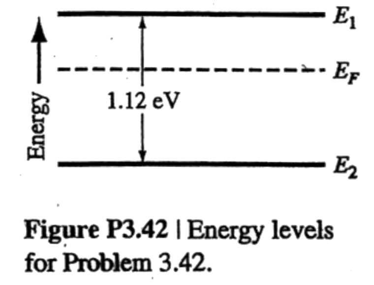

# hw03

## custom.01
An electron in a single isolated atom can have only *discrete* values of energies. However, when many atoms are brought together to form a crystal, an electron in the crystal can have ranges of *continuous* values of energies. Explain this above using appropriate diagrams for a diamond crystal and answer the following questions:

**(a)** Draw an Energy Band Diagram (EBD), name and label the upper and lower energy limits of each of the two *continuous* ranges of energies mentioned in Problem 1.

**(b)** What is Forbidden Energy Band Gap, $$E_g$$? Label it in the EBD drawn.

**(c)** Explain with appropriate diagrams how $$E_g$$ For $$\text{Si}$$, $$\text{Ge}$$, and $$\text{GaAs}$$ at room temperature.

**(d)** What are the probabilities that electrons will occupy an energy state within the two *continuous* ranges of energy states at $$0\:\text{K}$$?

## 3.41
The Fermi energy for copper at $$T=300\:\text{K}$$ is $$7.0\:\text{eV}$$. The electron in copper follow the Fermi-Dirac distribution function.

**(a)** Find the probability of an energy level at $$7.15\:\text{eV}$$ being occupied by an electron.

**(b)** Repeat part (a) for $$T=1000\:\text{K}$$. (Assume $$E_F$$ is a constant.)

**(c)** Repeat part (a) for $$E=6.85\:\text{eV}$$ and $$T=300\:\text{K}$$.

**(d)** Determine the probability of the energy state at $$E=E_F$$ being occupied at $$T=300\:\text{K}$$ and $$T=1000\:\text{K}$$.

## 3.42
Consider the energy levels shown in __Figure P3.42__. Let $$T=300\:\text{K}$$.

**(a)** If $$E_1-E_F=0.30\:\text{eV}$$, determine the probability that an energy state at $$E=E_1$$ is occupied by an electron and the probabiltiy that an energy state at $$E=E_2$$ is empty.

**(b)** Repeat part (a) if $$E_F-E_2=0.40\:\text{eV}$$.

## 3.46
**(a)** Calculate the temperature at which there is a $$10^{-8}$$ probability that an energy state $$0.60\:\text{eV}$$ above the Fermi energy level is occupied by an electron.

**(b)** Repeat part (a) for a probability of $$10^{-6}$$.
